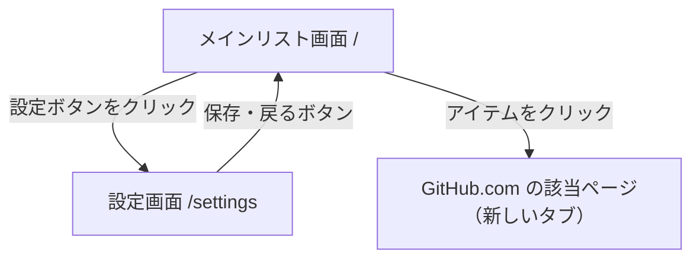

# UI

## 画面一覧

| 画面ID | 画面名 | パス | 概要 |
|--------|--------|------|------|
| SCR-001 | メインリスト画面 | `/` | Issue / PR 統合リスト + フィルタ |
| SCR-002 | 設定画面 | `/settings` | PAT 設定・リポジトリ管理 |

## 画面遷移図



## 画面機能仕様

### SCR-001 メインリスト画面

#### レイアウト

```
┌─────────────────────────────────────────┐
│ ヘッダー: タイトル + 設定ボタン + 更新ボタン + 最終更新時刻 │
├─────────────────────────────────────────┤
│ フィルタバー: タイプ / ステータス / リポジトリ / ラベル    │
├─────────────────────────────────────────┤
│ [アイテム行]                             │
│ [アイテム行]                             │
│ ...                                     │
└─────────────────────────────────────────┘
```

#### アイテム行の表示内容

```
[アイコン] owner/repo  #123  タイトルテキスト
          [open バッジ]  [ラベル1] [ラベル2]
          作成: 2024-01-01  更新: 2024-01-15  関連: #456 #789
```

| 要素 | 説明 |
|------|------|
| アイコン | Issue: ⊙（緑/赤）、PR: ⊕（紫/グレー）で open/closed を色で区別 |
| リポジトリ名 | `owner/repo` 形式 |
| 番号 | `#123` |
| タイトル | Issue/PR のタイトル（クリックで GitHub を新しいタブで開く） |
| ステータスバッジ | `open`（緑）/ `closed`（赤）/ `merged`（紫、PRのみ） |
| ラベル | 色付きバッジで最大3件表示（超過は「+N」） |
| 作成日 | `YYYY-MM-DD` 形式 |
| 更新日 | `YYYY-MM-DD` 形式 |
| 関連 Issue | `#456` 形式のリンク（PR本文から抽出、なければ非表示） |

#### 表示状態

| 状態 | 表示 |
|------|------|
| Loading | スケルトンローダーまたはスピナー |
| Empty（リポジトリ未設定） | 「設定画面でリポジトリを追加してください」+ 設定へのリンク |
| Empty（アイテムなし） | 「該当するアイテムがありません」 |
| Error（API エラー） | エラーメッセージ + 再試行ボタン |
| PAT 未設定 | 「設定画面でトークンを設定してください」+ 設定へのリンク |

### SCR-002 設定画面

#### レイアウト

```
┌─────────────────────────────────────────┐
│ ヘッダー: 「設定」+ 戻るボタン                │
├─────────────────────────────────────────┤
│ セクション: GitHub Token                  │
│   入力欄（masked）+ 検証ボタン + 削除ボタン  │
│   検証結果: ✓ username / ✗ エラーメッセージ │
├─────────────────────────────────────────┤
│ セクション: リポジトリ                      │
│   入力欄（owner/repo）+ 追加ボタン         │
│   ─────────────────────────────         │
│   owner/repo-1  [削除]                  │
│   owner/repo-2  [削除]                  │
└─────────────────────────────────────────┘
```

#### 表示状態

| 状態 | 表示 |
|------|------|
| Token 未設定 | 空の入力欄、検証・削除ボタン無効 |
| Token 検証中 | スピナー表示 |
| Token 有効 | 「✓ @username として認証済み」 |
| Token 無効 | 「✗ トークンが無効です」（赤） |
| リポジトリ追加エラー | 「リポジトリが見つかりません、またはアクセス権限がありません」 |

## コンポーネント一覧

| コンポーネント | 場所 | 説明 |
|--------------|------|------|
| `IssueList` | `components/IssueList/IssueList.tsx` | フィルタ済みアイテムのリスト |
| `IssueItem` | `components/IssueList/IssueItem.tsx` | 1件分の表示行 |
| `FilterBar` | `components/FilterBar/FilterBar.tsx` | タイプ・ステータス・リポジトリ・ラベルフィルタ |
| `TokenForm` | `components/Settings/TokenForm.tsx` | PAT 入力・検証・削除 |
| `RepoManager` | `components/Settings/RepoManager.tsx` | リポジトリ追加・削除 |
| `Badge` | `components/ui/Badge.tsx` | ラベル・ステータス表示用バッジ |
| `Spinner` | `components/ui/Spinner.tsx` | ローディングインジケータ |
| `Button` | `components/ui/Button.tsx` | 汎用ボタン |

## UI 規約

- **カラースキーム**: GitHub に近いトーンを使用（緑 = open、赤 = closed、紫 = merged/PR）
- **フォント**: システムフォント（`font-sans`）
- **レイアウト**: モバイルファースト、最大幅 `max-w-4xl` でセンタリング
- **ダークモード**: 初期フェーズでは対応しない
- **アニメーション**: ローディング時のスケルトンのみ
