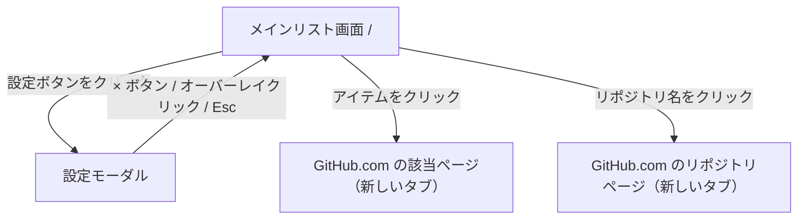

# UI

## 画面一覧

| 画面ID | 画面名 | パス | 概要 |
|--------|--------|------|------|
| SCR-001 | メインリスト画面 | `/` | Issue / PR 統合リスト + フィルタ |
| SCR-002 | 設定モーダル | `-`（`/` 上のモーダル） | PAT 設定・リポジトリ管理 |

## 画面遷移図



## 画面機能仕様

### SCR-001 メインリスト画面

#### レイアウト

```
┌─────────────────────────────────────────────────────┐
│ ヘッダー（濃紺 #24292f）: GitHub アイコン + タイトル      │
│                         + 最終更新時刻 + 更新ボタン + 設定ボタン │
├─────────────────────────────────────────────────────┤
│ フィルタバー: タイプ / ステータス / ラベル                  │
├─────────────────────────────────────────────────────┤
│ ┌─ owner/repo-1  N 件  ────────────────── [∧] ─┐   │
│ │ [アイテム行]                                   │   │
│ │ [アイテム行]                                   │   │
│ └───────────────────────────────────────────────┘   │
│ ┌─ owner/repo-2  N 件  ────────────────── [∧] ─┐   │
│ │ [アイテム行]                                   │   │
│ └───────────────────────────────────────────────┘   │
└─────────────────────────────────────────────────────┘
```

#### フィルタバー

| フィルタ | 種別 | デフォルト | 未選択時の動作 |
|---------|------|-----------|--------------|
| タイプ | 複数選択トグル（Issue / PR） | 両方選択 | 0 件表示 |
| ステータス | 複数選択トグル（Open / Closed） | Open 選択 | 0 件表示 |
| ラベル | pill 形式複数選択 | 全選択（空配列 = すべて表示） | 全件表示（フィルタ無効） |

#### リポジトリグループ

- アイテムはリポジトリ単位でグループ化して表示する
- グループヘッダー: リポジトリ名（GitHub リンク）・件数・折りたたみボタン
- グループ単位で折りたたみ・展開できる（デフォルト: 展開）

#### アイテム行の表示内容

```
[アイコン]  #123  タイトルテキスト
           [open バッジ]  [ラベル1] [ラベル2]
           作成: 2024-01-01  更新: 2024-01-15  関連: #456 #789
```

| 要素 | 説明 |
|------|------|
| アイコン | GitHub Octicons SVG（18×18px）。Issue open: 緑の円、Issue closed: 赤の円+チェック、PR open: 緑の PR、PR merged: 紫のマージ、PR closed: グレーの PR |
| 番号 | `#123` |
| タイトル | Issue/PR のタイトル（クリックで GitHub を新しいタブで開く） |
| ステータスバッジ | `open`（緑）/ `closed`（赤）/ `merged`（紫、PRのみ） |
| ラベル | アプリ固有カラーパレットで色付けしたバッジ（最大3件、超過は「+N」） |
| 作成日 | `YYYY-MM-DD` 形式 |
| 更新日 | `YYYY-MM-DD` 形式 |
| 関連 Issue | `#456` 形式（PR本文から抽出、なければ非表示） |

#### 表示状態

| 状態 | 表示 |
|------|------|
| Loading | スピナー |
| Empty（リポジトリ未設定） | 「設定画面でリポジトリを追加してください」+ 設定へのリンク |
| Empty（アイテムなし） | 「該当するアイテムがありません」 |
| Error（API エラー） | エラーメッセージ + 再試行ボタン |

### SCR-002 設定モーダル

メインリスト画面（SCR-001）上にオーバーレイ表示されるモーダル。独立したページルートは持たない。

#### 閉じる手段

| 操作 | 動作 |
|------|------|
| × ボタン（右上） | モーダルを閉じる |
| オーバーレイ（背景）クリック | モーダルを閉じる |
| Esc キー | モーダルを閉じる |

#### レイアウト

```
┌─────────────────────────────────────────────────────┐
│ ░░░░░░░ オーバーレイ（半透明黒） ░░░░░░░░░░░░░░░░░░░ │
│ ░  ┌──────────────────────────────────────────┐  ░ │
│ ░  │ 設定                               [×]  │  ░ │
│ ░  ├──────────────────────────────────────────┤  ░ │
│ ░  │ セクション: GitHub Token                  │  ░ │
│ ░  │   入力欄（masked）+ 検証ボタン + 削除ボタン │  ░ │
│ ░  │   検証結果: ✓ username / ✗ エラー         │  ░ │
│ ░  ├──────────────────────────────────────────┤  ░ │
│ ░  │ セクション: リポジトリ                      │  ░ │
│ ░  │   入力欄（owner/repo）+ 追加ボタン         │  ░ │
│ ░  │   owner/repo-1  [削除]                   │  ░ │
│ ░  │   owner/repo-2  [削除]                   │  ░ │
│ ░  └──────────────────────────────────────────┘  ░ │
└─────────────────────────────────────────────────────┘
```

#### 表示状態

| 状態 | 表示 |
|------|------|
| Token 未設定 | 空の入力欄、削除ボタン無効 |
| Token 検証中 | 「検証中...」表示 |
| Token 有効 | 「✓ @username として認証済み」（緑） |
| Token 無効 | 「✗ トークンが無効です」（赤） |
| リポジトリ追加エラー | 「リポジトリが見つかりません、またはアクセス権限がありません」（赤） |

## コンポーネント一覧

| コンポーネント | 場所 | 説明 |
|--------------|------|------|
| `IssueList` | `components/IssueList/IssueList.tsx` | リポジトリグループ表示・折りたたみ管理 |
| `IssueItem` | `components/IssueList/IssueItem.tsx` | 1件分の表示行 |
| `FilterBar` | `components/FilterBar/FilterBar.tsx` | タイプ・ステータス・ラベルフィルタ |
| `SettingsModal` | `components/Settings/SettingsModal.tsx` | 設定モーダル（開閉・Esc 対応） |
| `TokenForm` | `components/Settings/TokenForm.tsx` | PAT 入力・検証・削除 |
| `RepoManager` | `components/Settings/RepoManager.tsx` | リポジトリ追加・削除 |
| `Badge` | `components/ui/Badge.tsx` | ラベル・ステータス表示用バッジ |
| `Spinner` | `components/ui/Spinner.tsx` | ローディングインジケータ |

## UI 規約

### カラーパレット（GitHub UI トークン準拠）

| トークン | 値 | 用途 |
|---------|-----|------|
| ヘッダー背景 | `#24292f` | ヘッダー |
| ページ背景 | `#f6f8fa` | ページ全体の背景 |
| プライマリ | `#0969da` | アクティブボタン・リンク |
| メインテキスト | `#1f2328` | 本文テキスト |
| サブテキスト | `#636c76` | メタ情報・ラベル |
| ボーダー | `#d0d7de` | カード・入力欄の枠線 |
| エラー | `#cf222e` | エラーテキスト・削除ボタン |
| 成功 | `#1a7f37` | Open アイコン・成功メッセージ |
| マージ | `#8250df` | Merged PR アイコン |

### ラベルカラー

- ラベルの色はアプリ固有の 12 色パレット（`src/lib/labelColor.ts`）からラベル名のハッシュ値で決定する
- リポジトリに依存せず、同じラベル名は常に同じ色になる
- フィルタバーの pill とアイテム行のバッジで同じ色を使用する

### その他規約

- **フォント**: システムフォント（`font-sans`）
- **レイアウト**: 最大幅 `max-w-screen-xl` でセンタリング
- **ダークモード**: 対応しない
